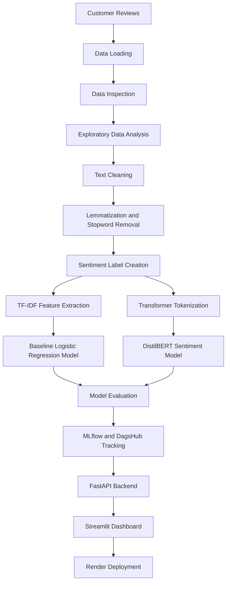
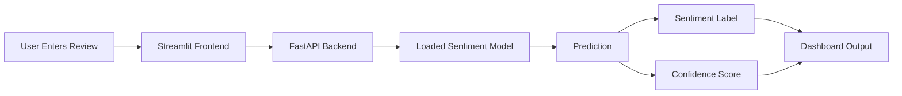

# shopease-sentiment-project
The purpose of this project is to develop a sentiment analysis NLP based model to automate the process of classifying user sentiment  or feedback concerning  a product

# ShopEase Sentiment Analysis Dashboard

An end-to-end Natural Language Processing (NLP) and Machine Learning project that transforms customer reviews into actionable sentiment insights for **ShopEase Europe**.

The system classifies customer feedback as **negative**, **neutral**, or **positive**, supports single-review prediction, enables batch CSV prediction, and provides a deployed frontend dashboard for real-time sentiment analysis.

---

## Live Project Links

- **Live Dashboard:** https://shopease-sentiment-frontend.onrender.com/
- **GitHub Repository:** https://github.com/inkumsah2012/shopease-sentiment-project

---

## Project Overview

ShopEase Europe receives large volumes of customer reviews from its online platform, mobile app, and external review portals. Manually reading and interpreting this feedback is slow, inconsistent, and difficult to scale.

This project solves that problem by building a sentiment analysis system that can automatically process customer reviews and classify them into sentiment categories. The final goal is not only prediction, but also helping business teams understand customer satisfaction patterns, identify recurring issues, and make faster data-driven decisions.

---

## Business Problem

Customer reviews contain valuable information about product quality, delivery experience, pricing, customer service, and user satisfaction. However, this information is unstructured and difficult to analyze manually at scale.

The project was designed to help ShopEase Europe:

- Monitor customer satisfaction across reviews
- Detect negative feedback and recurring complaints faster
- Understand sentiment patterns by product category, country, and rating
- Support product, marketing, operations, and customer service teams
- Turn customer feedback into measurable business insight

---

## Project Objectives

1. Build a data processing pipeline for customer feedback
2. Clean and preprocess noisy review text
3. Create sentiment labels from customer ratings
4. Perform exploratory data analysis on customer reviews
5. Train baseline machine learning models
6. Train transformer-based sentiment models
7. Evaluate model performance using classification metrics
8. Track and register models using MLflow and DagsHub
9. Build a backend API for sentiment prediction
10. Deploy an interactive dashboard for real-time and batch prediction

---

## Dataset Description

The dataset consists of anonymized customer reviews and feedback from ShopEase Europe.

| Feature | Description |
|---|---|
| Review ID | Unique identifier for each review |
| Product Category | Category of the reviewed product |
| Timestamp | Date and time of review submission |
| Country | Review origin, including UK, France, Germany, and Spain |
| Rating | Customer numerical rating |
| Review Text | Free-text customer feedback |
| Sentiment | Positive, neutral, or negative label |

The project dataset contains approximately **120,000 customer reviews** collected over an 18-month period.

Key data challenges include:

- Multilingual customer feedback
- Informal text, emojis, abbreviations, and punctuation noise
- Class imbalance across sentiment labels
- Need for scalable batch and real-time processing

---

## Tools and Technologies

| Stage | Tools Used |
|---|---|
| Programming | Python |
| Data Processing | Pandas, NumPy |
| NLP Preprocessing | NLTK, spaCy, langdetect |
| Visualization | Matplotlib, Seaborn |
| Baseline Modelling | Scikit-learn, TF-IDF, Logistic Regression |
| Transformer Modelling | Hugging Face Transformers, DistilBERT, PyTorch |
| Model Evaluation | Accuracy, Precision, Recall, F1-score, Confusion Matrix |
| Model Tracking | MLflow, DagsHub |
| Backend | FastAPI |
| Frontend Dashboard | Streamlit |
| Deployment | Docker, Render |
| Version Control | GitHub |

---

## End-to-End Project Workflow



---

# Step-by-Step Project Execution

## 1. Import Required Libraries

The project began by importing libraries for data manipulation, visualization, modelling, NLP preprocessing, and API development.

```python
import pandas as pd
import numpy as np
import matplotlib.pyplot as plt
from sklearn.model_selection import train_test_split
from sklearn.metrics import classification_report
from fastapi import FastAPI
import spacy
from langdetect import detect
from pathlib import Path
import nltk
from nltk.corpus import stopwords
from nltk.tokenize import word_tokenize
from nltk.stem import WordNetLemmatizer
import string
```

---

## 2. Load the Customer Review Dataset

The raw customer review dataset was loaded from Google Drive in the notebook.

```python
from pathlib import Path
import pandas as pd

data_path = Path("/content/drive/MyDrive/Sentiment_Analysis/raw_reviews.csv")
df = pd.read_csv(data_path)

df.head()
```

This step produced the main DataFrame used for exploration, preprocessing, and model training.

---

## 3. Inspect the Dataset

The dataset was inspected to understand its size, structure, data types, and missing values.

```python
print(df.shape)
df.info()
print(df.isnull().sum())
```

A sample dataset was also created for faster experimentation.

```python
sample_df = df.sample(n=3000, random_state=42)
sample_df.to_csv("sample_data.csv", index=False)
```

---

## 4. Perform Exploratory Data Analysis

Exploratory Data Analysis helped identify patterns in ratings, product categories, countries, and sentiment distribution.

### Rating Distribution

```python
df["rating"].value_counts().sort_index().plot(
    kind="bar",
    title="Distribution of Ratings"
)
plt.xlabel("Rating")
plt.ylabel("No of customer")
plt.show()
```

### Product Category Review Count

```python
import seaborn as sns

sns.countplot(
    y="product_category",
    data=df,
    order=df["product_category"].value_counts().index
)
plt.title("Review by Product Category")
plt.show()
```

### Sentiment by Product Category

```python
sns.countplot(
    y="product_category",
    hue="sentiment",
    data=df
)
plt.title("Sentiment breakdown per Category")
plt.show()
```

### Sentiment by Country

```python
sns.countplot(
    y="country",
    hue="sentiment",
    data=df
)
plt.title("Sentiment by Country")
plt.show()
```

### Sentiment by Rating

```python
sns.countplot(
    y="rating",
    hue="sentiment",
    data=df
)
plt.title("Sentiment distribution by Rating")
plt.show()
```

These notebook visuals showed how sentiment varied across customer rating levels, countries, and product categories.

---

## 5. Check Review Text for Noise

The review text was manually sampled to inspect noise such as emojis, punctuation, URLs, abbreviations, informal wording, and inconsistent casing.

```python
for review in df["review"].sample(5):
    print(review)
    print("-" * 80)
```

This helped guide the text cleaning strategy.

---

## 6. Prepare NLP Resources

NLTK resources were checked and downloaded when missing.

```python
def _ensure_nltk() -> None:
    try:
        _ = stopwords.words("english")
    except LookupError:
        nltk.download("stopwords")

    try:
        word_tokenize("test")
    except LookupError:
        nltk.download("punkt")

    try:
        nltk.data.find("tokenizers/punkt_tab/english/")
    except LookupError:
        nltk.download("punkt_tab")
    except Exception:
        pass

_ensure_nltk()
```

---

## 7. Clean Raw Review Text

A custom cleaning function was created to standardize review text before modelling.

```python
import re

def clean_text(text: str) -> str:
    """
    Clean raw text by removing noise.

    Processing Steps:
    1. Convert all characters to lowercase
    2. Remove URLs
    3. Remove special characters and punctuation
    4. Remove extra whitespace
    """
    text = str(text).lower()
    text = re.sub(r"http\S+|www\S+|https\S+", "", text)
    text = re.sub(r"[^a-z0-9\s]", "", text)
    text = re.sub(r"\s+", " ", text).strip()
    return text
```

Example cleaning test:

```python
dirty_example = "I LOVE this Shop!!! 😅😅😅 Visit http://shopease.com"
clean_sample = clean_text(dirty_example)

print(f"Dirty: {dirty_example}")
print(f"Clean: {clean_sample}")
```

---

## 8. Lemmatize Text and Remove Stopwords

The preprocessing pipeline used spaCy for lemmatization and NLTK for stopword removal.

```python
def _load_nlp():
    for model in ("en_core_web_sm", "xx_ent_wiki_sm"):
        try:
            return spacy.load(model)
        except OSError:
            continue
    return spacy.blank("xx")

NLP = _load_nlp()


def lemmatize(text: str) -> str:
    doc = NLP(text)
    return " ".join(token.lemma_ if token.lemma_ else token.text for token in doc)


def remove_stopwords(text: str) -> str:
    tokens = word_tokenize(text)
    sw = set(stopwords.words("english"))
    tokens = [t for t in tokens if t not in sw]
    return " ".join(tokens)
```

---

## 9. Apply Preprocessing and Create Sentiment Labels

The project created cleaned text columns and mapped customer ratings into sentiment labels.

```python
sentiment_data = df.copy()

sentiment_data["clean_text"] = sentiment_data["review"].apply(clean_text)
sentiment_data["lemma_text"] = sentiment_data["clean_text"].apply(lemmatize)
sentiment_data["final_text"] = sentiment_data["lemma_text"].apply(remove_stopwords)

sentiment_data["label"] = sentiment_data["rating"].apply(
    lambda r: 0 if r in (1, 2) else (1 if r == 3 else 2)
)

sentiment_data = sentiment_data[["review", "final_text", "label"]]
sentiment_data.head()
```

### Sentiment Label Mapping

| Rating | Label | Sentiment |
|---|---:|---|
| 1 or 2 | 0 | Negative |
| 3 | 1 | Neutral |
| 4 or 5 | 2 | Positive |

---

## 10. Train a Baseline Logistic Regression Model

A TF-IDF and Logistic Regression model was trained as a baseline benchmark.

```python
from sklearn.feature_extraction.text import TfidfVectorizer
from sklearn.linear_model import LogisticRegression
from sklearn.model_selection import train_test_split

X = sentiment_data["final_text"].astype(str)
y = sentiment_data["label"]

X_train, X_test, y_train, y_test = train_test_split(
    X,
    y,
    test_size=0.2,
    random_state=42
)

vectorizer = TfidfVectorizer(max_features=15000)
X_numbers = vectorizer.fit_transform(X_train)

print(f"Our math table has {X_numbers.shape[1]} columns")

model = LogisticRegression()
model.fit(X_numbers, y_train)

X_test_numbers = vectorizer.transform(X_test)
model.score(X_test_numbers, y_test)
```

---

## 11. Evaluate the Baseline Model

The baseline model was evaluated using accuracy, precision, recall, F1-score, and a confusion matrix.

```python
from sklearn.metrics import classification_report, confusion_matrix
from sklearn.metrics import ConfusionMatrixDisplay

# Generate predictions
y_pred = model.predict(X_test_numbers)

# Print precision, recall, F1-score, and accuracy
print(classification_report(y_test, y_pred))

# Plot confusion matrix
labels = ["Negative", "Neutral", "Positive"]
conf_matrix = confusion_matrix(y_test, y_pred)

disp = ConfusionMatrixDisplay(
    confusion_matrix=conf_matrix,
    display_labels=labels
)
disp.plot()
plt.title("Confusion Matrix")
plt.show()
```

### Baseline Classification Report

| Class | Precision | Recall | F1-score | Support |
|---|---:|---:|---:|---:|
| Negative | 0.91 | 0.97 | 0.94 | 3,677 |
| Neutral | 0.91 | 0.97 | 0.94 | 3,624 |
| Positive | 0.99 | 0.96 | 0.98 | 16,699 |
| **Accuracy** |  |  | **0.97** | **24,000** |
| **Macro Avg** | **0.94** | **0.97** | **0.95** | **24,000** |
| **Weighted Avg** | **0.97** | **0.97** | **0.97** | **24,000** |

### Baseline Confusion Matrix

| Actual \ Predicted | Negative | Neutral | Positive |
|---|---:|---:|---:|
| Negative | 3,575 | 51 | 51 |
| Neutral | 59 | 3,505 | 60 |
| Positive | 314 | 277 | 16,108 |

---

## 12. Prepare Transformer Tokenization

The project then moved to transformer-based modelling using multilingual DistilBERT.

```python
from transformers import AutoTokenizer

model_name = "distilbert-base-multilingual-cased"
tokenizer = AutoTokenizer.from_pretrained(model_name)

train_encodings = tokenizer(
    X_train.tolist(),
    truncation=True,
    padding=True,
    max_length=128
)

test_encodings = tokenizer(
    X_test.tolist(),
    truncation=True,
    padding=True,
    max_length=128
)
```

---

## 13. Create a PyTorch Sentiment Dataset

The tokenized text and labels were wrapped into a custom PyTorch Dataset for Hugging Face Trainer.

```python
import torch

class SentimentDataset(torch.utils.data.Dataset):
    def __init__(self, encodings, labels):
        self.encodings = encodings

        if hasattr(labels, "tolist"):
            self.labels = labels.tolist()
        elif hasattr(labels, "__iter__") and not isinstance(labels, (list, tuple)):
            self.labels = list(labels)
        else:
            self.labels = labels

    def __len__(self):
        return len(self.labels)

    def __getitem__(self, idx):
        item = {key: torch.tensor(val[idx]) for key, val in self.encodings.items()}
        item["labels"] = torch.tensor(self.labels[idx])
        return item

train_dataset = SentimentDataset(train_encodings, y_train)
test_dataset = SentimentDataset(test_encodings, y_test)
```

---

## 14. Configure Transformer Training

The transformer model was trained for three sentiment classes.

```python
from transformers import AutoModelForSequenceClassification

model = AutoModelForSequenceClassification.from_pretrained(
    model_name,
    num_labels=3
)
```

Training arguments:

```python
from transformers import TrainingArguments

training_args = TrainingArguments(
    output_dir="./results",
    num_train_epochs=3,
    per_device_train_batch_size=16,
    per_device_eval_batch_size=32,
    eval_strategy="epoch",
    save_strategy="epoch",
    logging_dir="./logs",
    logging_steps=50,
    save_total_limit=1,
    load_best_model_at_end=True,
    metric_for_best_model="accuracy"
)
```

---

## 15. Train and Evaluate the Transformer Model

Accuracy and weighted F1-score were used to evaluate the transformer model.

```python
import numpy as np
from sklearn.metrics import accuracy_score, f1_score
from transformers import Trainer


def compute_metrics(p):
    preds = np.argmax(p.predictions, axis=1)
    labels = p.label_ids
    acc = accuracy_score(labels, preds)
    f1 = f1_score(labels, preds, average="weighted")
    return {"accuracy": acc, "f1": f1}


trainer = Trainer(
    model=model,
    args=training_args,
    train_dataset=train_dataset,
    eval_dataset=test_dataset,
    compute_metrics=compute_metrics
)

trainer.train()
results = trainer.evaluate()
print(results)
```

---

## 16. Test Single Review Prediction

After training, the model was tested on new text examples.

```python
def test_prediction(text, model, tokenizer):
    inputs = tokenizer(
        text,
        return_tensors="pt",
        truncation=True,
        padding=True,
        max_length=128
    )

    device = next(model.parameters()).device
    inputs = {k: v.to(device) for k, v in inputs.items()}

    model.eval()
    with torch.no_grad():
        outputs = model(**inputs)
        probabilities = torch.nn.functional.softmax(outputs.logits, dim=-1)
        prediction = torch.argmax(probabilities, dim=-1)

    id2label = {0: "negative", 1: "neutral", 2: "positive"}
    predicted_label = id2label[prediction.item()]
    confidence = probabilities[0][prediction].item()

    return predicted_label, confidence, probabilities[0].cpu().numpy()
```

Example:

```python
label, confidence, probs = test_prediction(
    "I absolutely love this product! Best purchase ever!",
    model,
    tokenizer
)

print(label, confidence, probs)
```

Expected output:

```text
positive 0.99 [...]
```

---

## 17. Save the Trained Model

The trained model and tokenizer were saved for later use.

```python
model_save_path = "/content/drive/MyDrive/sentiment_model"

model.save_pretrained(model_save_path)
tokenizer.save_pretrained(model_save_path)

print(f"Model saved to {model_save_path}")
```

---

## 18. Track and Register the Model with MLflow and DagsHub

The project used MLflow and DagsHub to log metrics, parameters, and the trained transformer pipeline.

```python
import dagshub
import mlflow
from transformers import pipeline

metrics = trainer.evaluate(eval_dataset=test_dataset)

sentiment_pipeline = pipeline(
    task="text-classification",
    model=trainer.model,
    tokenizer=tokenizer,
    return_all_scores=True
)

dagshub.init(
    repo_owner="inkumsah2012",
    repo_name="shopease-sentiment-project",
    mlflow=True
)

mlflow.set_experiment("sentiment-analysis")

with mlflow.start_run():
    mlflow.transformers.log_model(
        transformers_model=sentiment_pipeline,
        name="model",
        registered_model_name="distilbert-multilingual-sentiment"
    )

    mlflow.log_metric("eval_accuracy", metrics["eval_accuracy"])
    mlflow.log_metric("eval_f1", metrics["eval_f1"])
    mlflow.log_metric("eval_loss", metrics["eval_loss"])

    mlflow.log_param("num_epochs", training_args.num_train_epochs)
    mlflow.log_param("batch_size", training_args.per_device_train_batch_size)
    mlflow.log_param("learning_rate", training_args.learning_rate)
```

---

## 19. Build the Backend API

The backend API serves the trained model and handles prediction requests.

Main API features:

- Single review prediction
- Batch CSV prediction
- Model training endpoint
- JSON response with sentiment and confidence score

Typical backend command:

```bash
uvicorn main.app:app --host 0.0.0.0 --port 8000
```

---

## 20. Build the Streamlit Frontend Dashboard

The frontend dashboard allows users to interact with the model without writing code.

Dashboard features:

- Enter one customer review and predict sentiment
- View prediction confidence
- Upload a CSV file for batch prediction
- View prediction table
- Download batch prediction results
- Trigger model training from the interface

Typical frontend command:

```bash
streamlit run streamlit_app.py
```

---

## 21. Dockerize the Project

Docker was used to make deployment reproducible and scalable.

### Backend Docker Commands

```bash
docker build -f DockerFile.backend -t shopease-sentiment-backend .
docker run --name shopease-backend --env-file .env -p 8000:8000 shopease-sentiment-backend
```

### Frontend Docker Commands

```bash
docker build -f DockerFile.frontend -t shopease-sentiment-frontend .
docker run --name shopease-frontend -e API_URL=http://localhost:8000 -p 8501:8501 shopease-sentiment-frontend
```

---

## 22. Deploy the Dashboard

The frontend dashboard was deployed on Render.

Live dashboard:

```text
https://shopease-sentiment-frontend.onrender.com/
```

The deployed dashboard demonstrates the project working end-to-end: users can enter a review, receive a sentiment label, and view the model confidence score.

---

## Dashboard Functionality



---

## Model Performance Summary

The baseline Logistic Regression model achieved strong performance on the test data.

| Metric | Score |
|---|---:|
| Accuracy | 0.97 |
| Weighted Precision | 0.97 |
| Weighted Recall | 0.97 |
| Weighted F1-score | 0.97 |
| Macro F1-score | 0.95 |

---

## Key Business Insights Enabled

The project enables teams to answer questions such as:

- Which product categories receive the most negative feedback?
- Which countries show stronger positive or negative sentiment?
- Are low ratings strongly aligned with negative sentiment?
- What review patterns indicate customer dissatisfaction?
- How can customer service teams respond faster to complaints?
- How can product and operations teams identify recurring issues?

---

## How to Run the Project Locally

### 1. Clone the Repository

```bash
git clone https://github.com/inkumsah2012/shopease-sentiment-project.git
cd shopease-sentiment-project
```

### 2. Create a Virtual Environment

For Windows:

```bash
python -m venv shopease_env
shopease_env\Scripts\activate
```

For macOS/Linux:

```bash
python -m venv shopease_env
source shopease_env/bin/activate
```

### 3. Install Dependencies

```bash
pip install -r requirements.txt
```

Backend-only dependencies:

```bash
pip install -r requirements_backend.txt
```

Frontend-only dependencies:

```bash
pip install -r requirements_frontend.txt
```

### 4. Train the Model

```bash
python pipeline/training.py
```

### 5. Start the Backend API

```bash
uvicorn main.app:app --host 0.0.0.0 --port 8000
```

### 6. Start the Frontend Dashboard

Open a second terminal and run:

```bash
streamlit run streamlit_app.py
```

---

## Repository Structure

```text
shopease-sentiment-project/
│
├── Data/
├── config/
├── main/
├── pipeline/
├── src/
├── utils/
├── streamlit_app.py
├── DockerFile.backend
├── DockerFile.frontend
├── requirements.txt
├── requirements_backend.txt
├── requirements_frontend.txt
└── README.md
```

---

## Final Project Execution Summary

The project was executed from start to finish by loading and exploring customer review data, cleaning noisy text, creating sentiment labels from ratings, training a TF-IDF Logistic Regression baseline model, evaluating the model using classification metrics and a confusion matrix, training a transformer-based DistilBERT model, testing predictions on new reviews, logging the model with MLflow and DagsHub, building a FastAPI backend, creating a Streamlit frontend dashboard, containerizing the system with Docker, and deploying the dashboard online using Render.

---

## Project Execution Checklist

| Stage | What Was Done | Output |
|---|---|---|
| Data Loading | Loaded raw customer review CSV | DataFrame ready for analysis |
| Data Inspection | Checked shape, data types, and missing values | Data quality understanding |
| EDA | Visualized ratings, categories, countries, and sentiment | Business understanding of feedback patterns |
| Text Cleaning | Removed URLs, punctuation, special characters, and extra spaces | Clean review text |
| NLP Preprocessing | Applied lemmatization and stopword removal | Final text column |
| Labelling | Mapped ratings into 3 sentiment classes | Label column |
| Baseline Model | Trained TF-IDF and Logistic Regression | Benchmark performance |
| Transformer Model | Trained DistilBERT sequence classifier | Advanced sentiment model |
| Evaluation | Used accuracy, F1-score, classification report, and confusion matrix | Model performance evidence |
| Tracking | Logged model and metrics with MLflow/DagsHub | Registered model version |
| Backend | Built FastAPI prediction API | Model serving layer |
| Frontend | Built Streamlit dashboard | User-facing interface |
| Deployment | Deployed frontend dashboard on Render | Live sentiment analysis app |

---

## Portfolio Summary

This project demonstrates practical skills in data science, NLP, machine learning, transformer modelling, model evaluation, MLOps, API development, dashboard design, Docker, and cloud deployment.

It shows how customer feedback can be transformed from unstructured text into business insights that support better decision-making across product, marketing, operations, and customer service teams.

---
